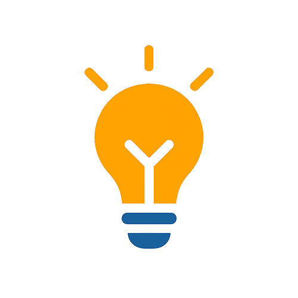

# 👋 Hi, I'm Yusuf Setiyawan

**Full-Stack Software Engineer** • 3+ Years Experience

I'm a passionate self-taught Software Engineer in JavaScript & Go development. I specialize in crafting robust Backend solutions and creating engaging Frontend experiences. I take joy in building exceptional software products that make a lasting impact. Let's transform ideas into innovation!

## 🚀 Personal Projects

  

**[ruangbimbel.id](https://ruangbimbel.id/)** - **Online Learning Platform for CPNS, BUMN & UTBK Exam Preparation**

Solo-built from zero to production: complete learning platform with study materials, question banks, realistic simulations, scoring, and personalized insights.

- **Stack:** Next.js • TanStack Query • Go • PostgreSQL • Redis • Docker • CI/CD
- **Role:** End-to-end ownership (Figma design → architecture → deployment → analytics)
- **Impact:** Production-ready with real user traffic, optimized performance & seamless UX

## 💻 My Tech Stack

**Languages** •   

**Frontend** •      

**State & Data** •  

**Backend** •    

**Database & Cache** •    

**DevOps & Tools** •    

---

**Let's build something great together!**

